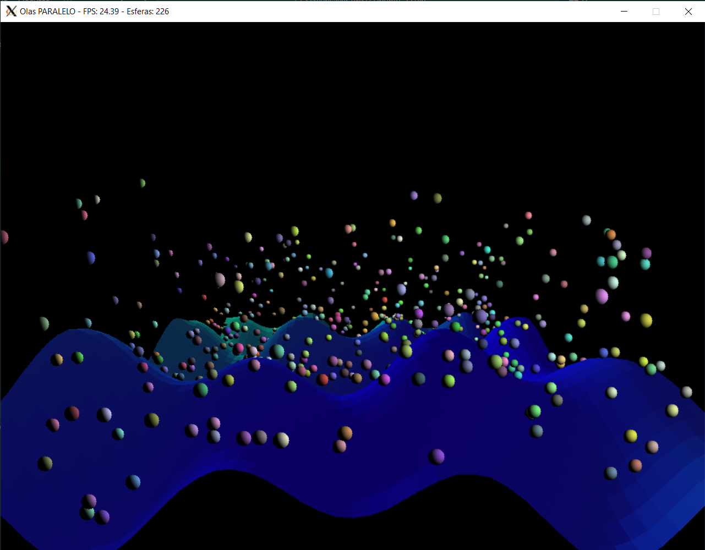
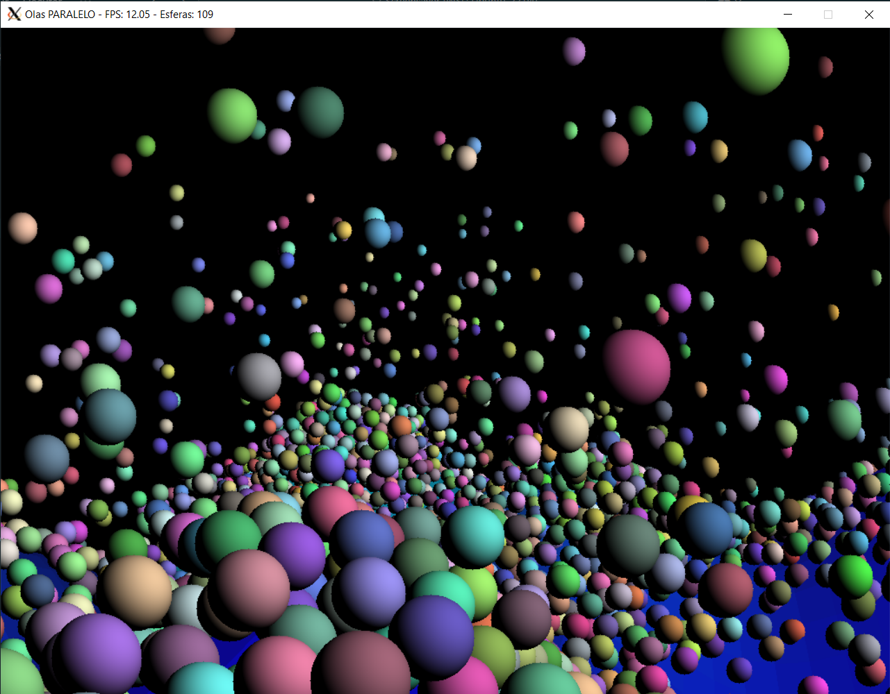

# Screensaver: Simulador de Esferas en Terreno Ondulado - Proyecto OpenMP

## Descripción del Proyecto

Este proyecto implementa un screensaver 3D que simula esferas rebotando en un terreno ondulado dinámico. El programa está desarrollado en dos versiones: **secuencial** y **paralela** (usando OpenMP), permitiendo comparar el rendimiento entre ambas implementaciones.

### Características Principales

- **Simulación física realista** con gravedad, rebotes y colisiones entre esferas
- **Terreno ondulado dinámico** generado mediante funciones trigonométricas
- **Renderizado 3D** con proyección de perspectiva y z-buffering
- **Iluminación difusa** para efectos visuales realistas
- **Múltiples modos de cámara** (rotación automática, vista aérea, vista lateral)
- **Medición de FPS** en tiempo real
- **Paralelización con OpenMP** para mejora del rendimiento

## Requisitos del Sistema

### Dependencias
- **Compilador C** con soporte para OpenMP (GCC recomendado)
- **SDL2** - Simple DirectMedia Layer 2.0
- **Biblioteca matemática** (libm)

### Instalación de SDL2

#### Ubuntu/Debian
```bash
sudo apt-get install libsdl2-dev
```

## Compilación

### Versión Secuencial
```bash
gcc -o div_secuencial div_secuencial.c -lSDL2 -lm -O3
```

### Versión Paralela
```bash
gcc -o div_paralelo div_paralelo.c -lSDL2 -lm -fopenmp -O3
```

## Uso del Programa

### Ejecución Básica
```bash
# Versión secuencial con configuración por defecto
./div_secuencial

# Versión paralela con configuración por defecto
./div_paralelo
```

### Parámetros de Línea de Comandos

```bash
./div_secuencial [num_esferas] [tamaño_grid]
./div_paralelo [num_esferas] [tamaño_grid]
```

#### Parámetros
- **num_esferas**: Número de esferas a simular (por defecto: 10,000 secuencial, 100,000 paralelo)
- **tamaño_grid**: Tamaño de la malla del terreno (por defecto: 40)

#### Ejemplos
```bash
# 5000 esferas en un grid de 50x50
./div_paralelo 5000 50

# 1000 esferas en el grid por defecto
./div_secuencial 1000
```




## Controles

### Teclas
- **1**: Cámara en rotación automática alrededor del centro
- **2**: Vista aérea oblicua 
- **3**: Vista lateral fija
- **ESC**: Salir del programa

### Redimensionamiento
- La ventana soporta redimensionamiento dinámico
- Los buffers de renderizado se ajustan automáticamente

## Características Técnicas

### Renderizado
- **Resolución mínima**: 1024x768 píxeles
- **Proyección 3D**: Transformación de perspectiva con FOV configurable
- **Z-buffering**: Para manejo correcto de profundidad
- **Framebuffer personalizado**: Renderizado por software optimizado

### Física
- **Gravedad**: Constante de -0.02 unidades por frame
- **Rebote**: Factor de elasticidad de 0.7
- **Colisiones**: Detección y resolución entre esferas
- **Terreno dinámico**: Ondas generadas por múltiples funciones sinusoidales

### Paralelización (Versión Paralela)
- **Física de movimiento**: Paralelizada con `#pragma omp parallel for`
- **Detección de colisiones**: Paralelizada con sincronización por locks
- **Renderizado**: División por cuadrantes para procesamiento paralelo
- **Cálculo de alturas**: Paralelización del terreno ondulado
- **Reset de buffers**: Distribución del trabajo entre hilos

## Archivos de Salida

### Logs de FPS
- **fps_log_secuencial.txt**: FPS de la versión secuencial
- **fps_log_paralelo.txt**: FPS de la versión paralela

Estos archivos contienen una medición de FPS por línea, útiles para análisis de rendimiento.

## Estructura del Proyecto

```
proyecto/
├── div_secuencial.c          # Implementación secuencial
├── div_paralelo.c            # Implementación paralela
├── README.md                 # Este archivo
├── fps_log_secuencial.txt    # Log de FPS secuencial (generado)
└── fps_log_paralelo.txt      # Log de FPS paralelo (generado)
```

## Análisis de Rendimiento

### Métricas Importantes
- **FPS (Frames Per Second)**: Medido y mostrado en tiempo real
- **Speedup**: Comparación entre versión secuencial y paralela
- **Eficiencia**: Utilización de recursos de CPU

### Factores que Afectan el Rendimiento
- Número de esferas
- Tamaño del grid del terreno
- Número de hilos disponibles
- Resolución de la ventana

## Información 

### Objetivos del Proyecto
- Implementar paralelización con OpenMP
- Aplicar el método PCAM para descomposición de problemas
- Analizar speedup y eficiencia en programas paralelos
- Desarrollar habilidades en programación de memoria compartida

### Contribuidores

* Diego Duarte Slowing 22075
* Fabiola Contreras 22787
* María José Villafuerte 22129